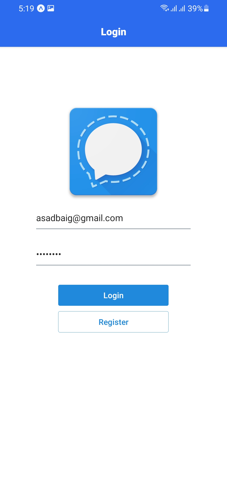

## About The Project

This repository contains the code for the signal chat app which is built using Expo CLI. Firebase is used for the authentication as well as for DB to store the chat between two users.

## App UI ScreenShots

<p align="center">

<a>
    
    
    
    
    
    
    

</a>
</p>

### Installation

1. Clone the repo
   ```sh
   git clone https://github.com/AsadBaig039/Signal-Clone.git
   ```
2. Install NPM packages

   ```sh
   npm install
   ```

### Run Application

1. Install expo app on your physical device (on Emulator expo app will be installed automatically)
2. Open VSCode Terminal
3. Run the Command
   ```sh
   expo start
   ```
4. Choose Tunnel option (Incase LAN does not work).
5. Open Expo App on your mobile or emulator
6. Scan the QR Code
7. Bundle will start building

and here u go!!!!!!!!

## Contact

ASAD BAIG - [asad.baig039@gmail.com](asad.baig039@gmail.com)

Project Link: [https://github.com/AsadBaig039/Signal-Clone.git](https://github.com/AsadBaig039/Signal-Clone.git)

<!-- ACKNOWLEDGEMENTS -->

## Acknowledgements

- [npm](https://www.npmjs.com/)
- [React Native Navigation](https://reactnavigation.org/docs/getting-started/)
- [Expo Icon Pack](https://docs.expo.io/guides/icons/)
- [React Native Elements](https://reactnativeelements.com/docs)
- [Firebase](https://firebase.google.com/)
- [cloudinary](http://cloudinary.com/)
